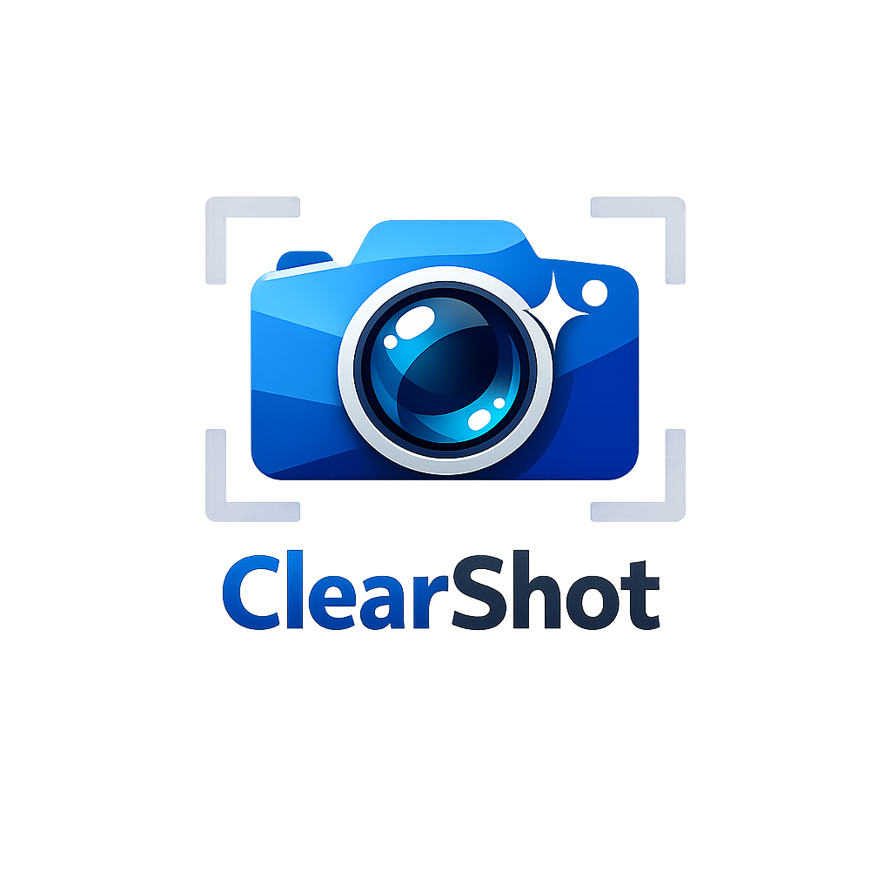
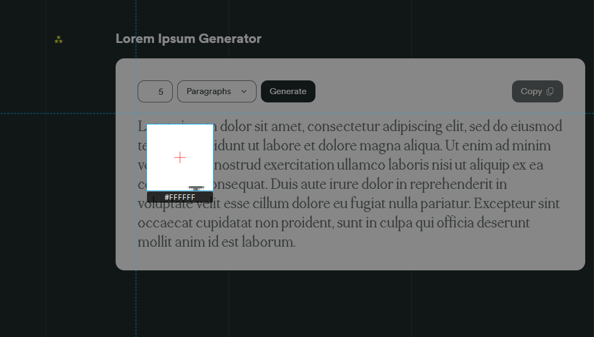
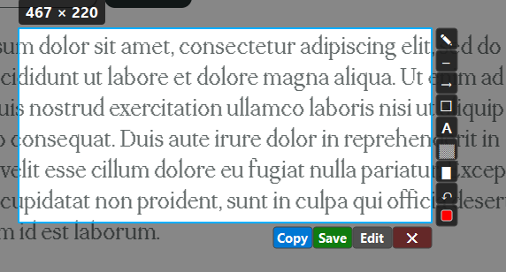
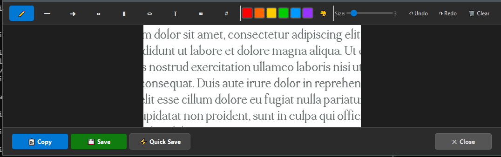
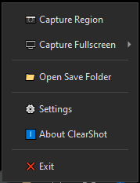
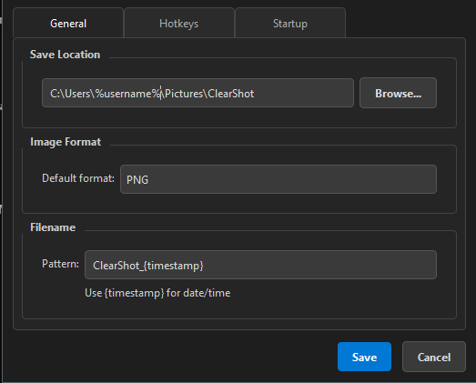
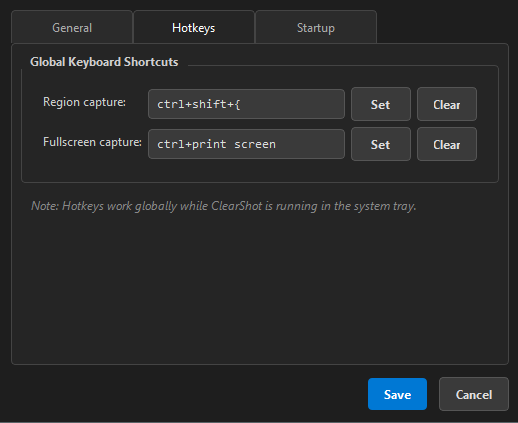
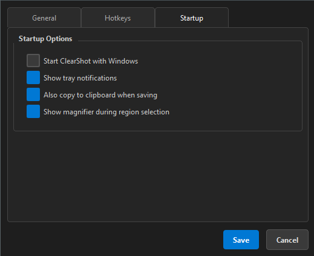

<p align="center">
  
</p>

<h1 align="center">ClearShot</h1>

<p align="center">
  <b>A lightweight, fast screenshot tool for Windows</b><br>
  Capture regions or fullscreen • Annotate with built-in tools • Copy or save instantly
</p>

<p align="center">
  <a href="https://github.com/GoblinRules/ClearShot/releases"></a>
  <a href="LICENSE"></a>
  
</p>

---

## ✨ Features

- **Region Capture** — Select any area of your screen with a crosshair overlay
- **Fullscreen Capture** — Grab your entire screen (or pick a specific monitor)
- **Built-in Annotation Editor** — Draw, highlight, blur, and add text before saving
- **Quick Actions** — Copy to clipboard, save to file, or quick-save with one click
- **System Tray** — Lives quietly in your tray, always ready
- **Customizable Hotkeys** — Set your own keybindings
- **Auto-Start** — Optionally launch on Windows startup
- **Dark UI** — Clean, modern dark theme

---

## 📸 Screenshots

### Region Selection
> Click and drag to select any region. A crosshair cursor with dimension display helps you capture exactly what you need.



### Selection Options
> After selecting a region, choose to copy, save, or open the annotation editor.



### Built-in Annotation Editor
> Full annotation toolbar with pen, line, arrow, rectangle, ellipse, text, blur, and numbered markers. Adjust colors and sizes, undo/redo, then copy or save.



### System Tray Menu
> Right-click the tray icon to access all features — capture, open save folder, settings, and more.



### Settings
> Configure save location, image format, filename pattern, hotkeys, and startup behavior.

| General | Hotkeys | Startup |
|---------|---------|---------|
|  |  |  |

---

## 🚀 Getting Started

### Option 1: Download the Portable Executable

1. Go to the [Releases](https://github.com/GoblinRules/ClearShot/releases) page
2. Download `ClearShot.exe`
3. Run it — no installation required

### Option 2: Run from Source

**Requirements:** Python 3.10+

```bash
# Clone the repository
git clone https://github.com/GoblinRules/ClearShot.git
cd ClearShot

# Install dependencies
pip install -r requirements.txt

# Run
python main.py
```

---

## 🎯 How to Use

### Taking a Screenshot

| Action | Default Hotkey |
|--------|---------------|
| **Region Capture** | `Print Screen` |
| **Fullscreen Capture** | `Ctrl + Print Screen` |

You can also right-click the **system tray icon** to access capture options.

### Region Capture

1. Press `Print Screen` (or your custom hotkey)
2. Your screen dims — click and drag to select the area
3. Release to see the selection toolbar:
   - **📋 Copy** — Copy to clipboard
   - **💾 Save** — Save to file (opens file dialog)
   - **⚡ Quick Save** — Save instantly to your configured folder
   - **✏️ Edit** — Open the annotation editor
   - **✕ Cancel** — Discard the capture

### Annotation Editor

After opening the editor, you have access to a full toolbar:

| Tool | Description |
|------|-------------|
| ✏️ **Pen** | Freehand drawing |
| ─ **Line** | Straight lines |
| → **Arrow** | Arrows with heads |
| □ **Rectangle** | Outlined rectangles |
| ■ **Filled Rectangle** | Solid rectangles |
| ○ **Ellipse** | Circles and ovals |
| **T** **Text** | Click to type text |
| ▪ **Blur** | Blur sensitive content |
| **#** **Counter** | Numbered markers (1, 2, 3...) |

- Pick colors from the palette
- Adjust brush/line size with the slider
- **Undo / Redo** your edits
- **Clear** to start over

### Settings

Right-click the tray icon → **Settings**, or the settings window offers three tabs:

- **General** — Save location, image format (PNG/JPEG/BMP), filename pattern
- **Hotkeys** — Customize keyboard shortcuts
- **Startup** — Enable/disable launching ClearShot on Windows startup

---

## 🔨 Building the Executable

```bash
# Install PyInstaller
pip install pyinstaller

# Build single-file portable exe
python -m PyInstaller build.spec --clean -y
```

The output will be at `dist/ClearShot.exe`.

---

## 📁 Project Structure

```
ClearShot/
├── main.py              # Entry point with single-instance lock
├── app.py               # System tray app & core orchestration
├── overlay.py           # Screen overlay for region selection
├── annotator.py         # Built-in annotation editor
├── capture.py           # Screen capture via mss
├── clipboard_utils.py   # Clipboard operations (Win32)
├── config.py            # Settings persistence
├── constants.py         # App constants & defaults
├── settings_window.py   # Settings dialog (PyQt6)
├── tools.py             # Annotation tool implementations
├── requirements.txt     # Python dependencies
├── build.spec           # PyInstaller build configuration
├── installer.iss        # Inno Setup installer script
└── assets/
    ├── icon.ico         # Application icon
    ├── icon.png         # Application icon (PNG)
    └── screenshots/     # README screenshots
```

---

## ⚠️ Disclaimer

This software is provided "as is", without warranty of any kind. Use it at your own risk. The authors are not liable for any damages or data loss resulting from its use.

**Privacy & Security:** ClearShot captures screen content and stores images locally on your machine. It does **not** transmit any data externally. However, screenshots may contain sensitive information — be mindful of what you capture, where you save it, and with whom you share it. You are solely responsible for the content you capture and distribute.

---

## 📄 License

This project is licensed under the [MIT License](LICENSE).
